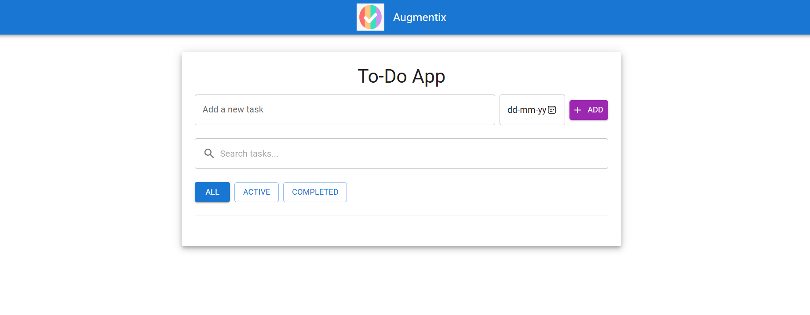

# Advanced To-Do App

This is an advanced To-Do List application built using the MERN (MongoDB, Express.js, React.js, Node.js) stack. The application features a modern and responsive design, allowing users to manage their tasks efficiently with enhanced functionality and user experience.

## Features

- **Task Management:** Users can add, edit, and delete tasks.
- **Due Date Management:** Tasks can have due dates that are editable and displayed.
- **Completion Status:** Users can mark tasks as completed or active using a checkbox.
- **Search and Filter:** Includes search functionality to filter tasks by title and filter buttons to view all, active, or completed tasks.
- **Enhanced UI:** Modern and attractive user interface with:
  - A fixed header with the company logo and name aligned to the left.
  - A centered To-Do App title.
  - Stylish buttons, input fields, and task list items.
  - Responsive design that adapts to different screen sizes.
- **Error Handling:** Robust error handling for tasks and due date updates.

## Technologies Used

- **Frontend:**
  - **React.js** for building the user interface.
  - **Material-UI** for component styling and layout.
- **Backend:**
  - **Node.js** and **Express.js** for server-side logic and API endpoints.
  - **MongoDB** for storing task data.

## Installation

1. Clone the repository:
   ```bash
   git clone https://github.com/yourusername/advanced-todo-app.git
   ```

2. Navigate to the project directory:
   ```bash
   cd advanced-todo-app
   ```

3. Install dependencies:
   - For the client:
     ```bash
     cd client
     npm install
     ```
   - For the server:
     ```bash
     cd ../server
     npm install
     ```

4. Start the development servers:
   - For the client:
     ```bash
     cd client
     npm start
     ```
   - For the server:
     ```bash
     cd ../server
     npm start
     ```

## Usage

- Access the application in your web browser at `http://localhost:3000` for the frontend.
- The backend API runs on `http://localhost:5000`.

## Contributing

Contributions are welcome! Please open an issue or a pull request if you'd like to contribute to the project.

